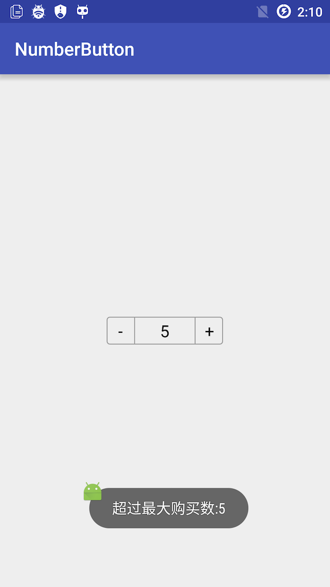

# NumberButton

####自定义组件：购物车商品数量、增加和减少控制按钮。

####说明：
1. 可以定义最大库存、当前数量、最大购买数量
* 可以打开或关闭数量输入
* 可以按钮和输入框的宽度

#####使用
* 引入 
	* compile 'ren.qinc.numberbutton:numberbutton:0.0.1'
* 布局

```xml
<ren.qinc.numberbutton.NumberButton
    android:id="@+id/number_button"
    android:layout_width="wrap_content"
    android:layout_height="wrap_content"
    qinc:editable="true"/>
```

* 初始化和设置

```java
NumberButton numberButton = (NumberButton) findViewById(R.id.number_button);
//assert numberButton != null;
numberButton.setBuyMax(5)
        .setInventory(6)
        .setCurrentNumber(10)
        .setOnWarnListener(new NumberButton.OnWarnListener() {
            @Override
            public void onWarningForInventory(int inventory) {
                Toast.makeText(MainActivity.this, "当前库存:" + inventory, Toast.LENGTH_SHORT).show();
            }

            @Override
            public void onWarningForBuyMax(int buyMax) {
                Toast.makeText(MainActivity.this, "超过最大购买数:" + buyMax, Toast.LENGTH_SHORT).show();
            }
        });

```
* 其他：
 * 你可以设置的属性有：
		* editable(boolean):是否可以编辑数量
		* buttonWidth(dimension):按钮区域宽度
		* textWidth(dimension):数量区域宽度
		* textSize(dimension):数量文本大小
		* textColor(color):文本颜色


